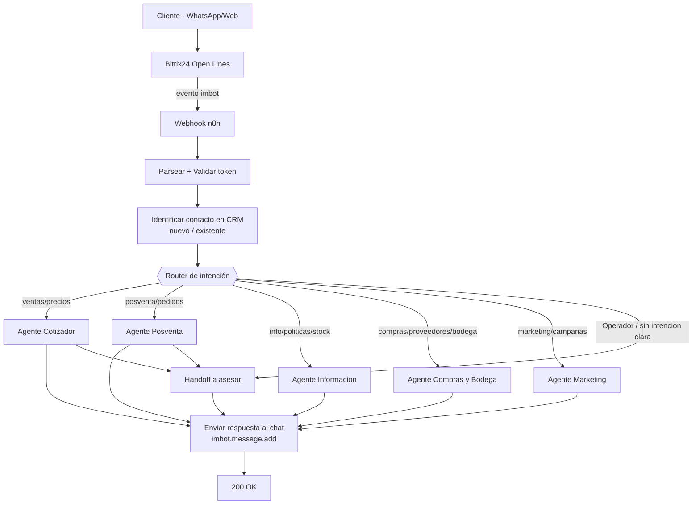

# Flujo de atención al cliente — Arquitectura multi-agente (Demaco / n8n + Ollama)

> Documento de **diseño** (no es código). Define (1) el flujo de atención que conduce la IA y
> (2) el método para construir los workflows JSON de n8n. Es la referencia que seguiremos al
> implementar. El bot original "RoberthV2" era un único agente; aquí lo evolucionamos a un
> **router + agentes especializados**.

## 1. Decisiones de negocio que fijan el diseño

| Decisión | Valor acordado |
|---|---|
| Canal | Bitrix24 **Open Lines** (WhatsApp / web), eventos `imbot` → n8n |
| Modelo | **Ollama `llama3.1`** (local) para todos los agentes |
| Precios | El bot **da precios de referencia** y aclara que el final depende de B2B/B2C y lo confirma un asesor |
| Handoff a humano | **Tras capturar el requerimiento** (datos del cliente + lo que necesita), o si el cliente escribe "Operador" |
| Estructura | **1 router de intención + 5 agentes especializados** |
| Identidad | Al inicio se identifica si el contacto es **nuevo o existente** (CRM), compartido por todos los agentes |

## 2. Arquitectura general



**Principio**: el router NO conversa; solo clasifica y delega. Cada agente especializado es
experto en su dominio, tiene su propio *system prompt*, sus herramientas y sus fuentes de
datos. La memoria de la conversación es **compartida por `DIALOG_ID`** para que el cliente no
tenga que repetir datos si cambia de tema (re-enrutado).

## 3. El router de intención

- **Entrada**: mensaje actual + breve historial + flag `clienteExiste`.
- **Salida** (JSON estructurado, temperatura baja):
  ```json
  { "intencion": "VENTAS_COTIZACION", "confianza": 0.0-1.0, "motivo": "..." }
  ```
- **Intenciones**:

| Código | Se activa cuando… | Va a |
|---|---|---|
| `VENTAS_COTIZACION` | pide precio, cotización, productos, "¿tienen…?", sugerencias | Agente Cotizador |
| `POSVENTA_PEDIDOS` | pregunta por un pedido/factura existente, reclamo, garantía, devolución | Agente Posventa |
| `INFO_POLITICAS_STOCK` | horarios, locales, formas de pago, transporte, stock, info de empresa | Agente Información |
| `COMPRAS_BODEGA` | es proveedor que ofrece productos, o agenda turno de bodega para entregar | Agente Compras y Bodega |
| `MARKETING_CAMPANAS` | llega desde un anuncio/campaña, promoción, captación | Agente Marketing |
| `HUMANO` | escribe "Operador" o pide explícitamente una persona | Handoff directo |
| `OTRO` | saludo, ambiguo, fuera de alcance | Pedir aclaración / fallback |

- **Regla de desambiguación**: si `confianza < 0.5`, el router hace **una** pregunta corta para
  aclarar antes de delegar (no adivina).
- **Re-enrutado**: en cada turno se reevalúa; si la intención cambia (p. ej. de cotización a
  posventa), el orquestador cambia de agente conservando la memoria del `DIALOG_ID`.

## 4. Agentes especializados

Cada ficha define: **propósito**, **datos que capta**, **herramientas/fuentes** y **salida/handoff**.

### 4.1 Agente Cotizador (pre-venta)
- **Propósito**: experto en productos; sugiere, da **precios de referencia** y arma el requerimiento.
- **Capta**: Nombre, persona natural o empresa, RUC/Cédula, Razón social, Teléfono, Email, Ciudad,
  tipo de venta (B2B/B2C), **lista de productos** (ítems + cantidades).
- **Herramientas/fuentes**:
  - `product_lookup` → catálogo + precios de referencia desde **DB / ERP** (vía API; ver §6).
  - `crm_find_contact`, `crm_create_lead` / `crm_update_contact`.
  - `openlines_transfer`.
- **Salida/handoff**: entrega precios de referencia con el disclaimer B2B/B2C; al tener cliente +
  requerimiento → crea/actualiza Lead y **transfiere a asesor de ventas** para cotización formal.

### 4.2 Agente Posventa / Gestión de pedidos
- **Propósito**: consultas sobre pedidos existentes, estado, reclamos, garantías, devoluciones.
- **Capta**: identificación del cliente (contacto existente), N.º de pedido/factura, motivo, evidencia.
- **Herramientas/fuentes**:
  - `order_lookup` → estado del pedido desde el **ERP externo** (vía API; ver §6).
  - `crm_find_contact`; crear **actividad/ticket** de seguimiento.
  - `openlines_transfer` (cola de posventa).
- **Salida/handoff**: responde estado si es consulta simple; si es reclamo/gestión → registra y deriva.

### 4.3 Agente Información / Políticas / Stock / Procesos
- **Propósito**: responder con la base de conocimiento de la empresa (el más informativo, buen MVP).
- **Capta**: poco; solo lo necesario para precisar la respuesta.
- **Herramientas/fuentes**:
  - `kb_search` → base de conocimiento (políticas, horarios, locales, formas de pago, transporte
    gratis > $50, info de empresa) *(vector store o FAQ — ver §6)*.
  - `stock_check` → disponibilidad *(fuente por definir; si requiere confirmación, deriva)*.
- **Salida/handoff**: responde directo; deriva solo si el stock exige confirmación humana.

### 4.4 Agente Compras (proveedores) y Turnos de bodega
- **Propósito**: dos sub-casos — (a) proveedores que ofrecen productos a Demaco; (b) **agendar turnos
  de bodega** para recepción de pedidos.
- **Capta**:
  - Proveedor: empresa, contacto, productos ofertados, condiciones.
  - Turno: tipo de carga, volumen, fecha/hora deseada, transportista.
- **Herramientas/fuentes**:
  - `schedule_slot` → agenda de turnos *(calendario por definir: Google Calendar / Bitrix Calendar — ver §6)*.
  - Registro del proveedor (Lead/Company con marca "proveedor").
  - `openlines_transfer` (cola de compras/bodega).
- **Salida/handoff**: confirma turno o registra al proveedor y deriva al área correspondiente.

### 4.5 Agente Marketing / Campañas / Captación
- **Propósito**: atender entradas desde campañas de redes específicas y captar clientes.
- **Capta**: datos de contacto + **origen/campaña** (UTM o canal de la Open Line), interés/promoción.
- **Herramientas/fuentes**:
  - `crm_create_lead` con `SOURCE_ID`/UTM de la campaña.
  - `kb_search` para condiciones de la promoción.
- **Salida/handoff**: crea Lead etiquetado por campaña, responde la promoción y nutre o deriva a ventas.

## 5. Componentes transversales (compartidos)

- **Identificación de contacto** (`crm_find_contact`): se ejecuta una vez al entrar; el resultado
  (`existe`, `contactId`) viaja a todos los agentes.
- **Memoria por `DIALOG_ID`**: compartida entre agentes. Como los especialistas corren como
  ejecuciones separadas, la memoria debe ser **persistente** (Postgres/Redis) keyed por `DIALOG_ID`,
  no `static data` por workflow.
- **Handoff a asesor** (`openlines_transfer`): con la **cola correcta** según el agente (ventas,
  posventa, compras/bodega). Mensaje de aviso al cliente antes de transferir.
- **Guardrails**: no inventar precios/stock fuera de las fuentes; no responder fuera de alcance;
  registrar la intención y la acción tomada en cada turno (para auditoría).

## 6. Dependencias a definir (fuentes de datos)

Estas decisiones desbloquean a cada agente; las marcamos como pendientes:

| Necesidad | Para | Decisión |
|---|---|---|
| **Catálogo + precios de referencia** | Cotizador | ✅ **DB / ERP** (vía API) — *falta: endpoint, auth y esquema de respuesta* |
| **Sistema de pedidos** | Posventa | ✅ **ERP externo** (vía API) — *falta: endpoint, auth y campos del pedido* |
| **Base de conocimiento** | Información/Políticas/Marketing | *Por definir:* Vector store (embeddings Ollama `nomic-embed-text`) · FAQ en Sheet/MD |
| **Disponibilidad/stock** | Información | *Por definir:* ERP/inventario · "deriva siempre" |
| **Calendario de turnos** | Compras y Bodega | *Por definir:* Google Calendar · Bitrix24 Calendar |
| **Memoria persistente** | Todos | *Por definir:* Postgres · Redis |

> Para el **ERP** (cotizador y posventa) necesitaremos, cuando toque cada fase: URL base del API,
> método de autenticación (API key / OAuth) y la forma de las respuestas (campos de producto/precio
> y de pedido/estado). Con eso se definen los nodos `product_lookup` y `order_lookup`.

## 7. Cómo construiremos el JSON de n8n (método)

**Patrón elegido: Orquestador + sub-workflows.** Más claro, testeable y barato que un solo
agente gigante; cada especialista se edita y prueba por separado.

1. **Definir el contrato** (entrada/salida estándar entre orquestador y especialistas):
   ```jsonc
   // Entrada a un sub-workflow especialista
   { "dialogId": "", "chatId": "", "message": "",
     "contact": { "existe": false, "contactId": "", "nombre": "", "email": "", "telefono": "" } }
   // Salida de un sub-workflow especialista
   { "reply": "texto para el cliente",
     "handoff": false, "cola": "ventas|posventa|compras",
     "accionCRM": "ninguna|crear_lead|actualizar_ficha|crear_actividad" }
   ```
2. **Herramientas compartidas primero**: `crm_find_contact`, `crm_create_lead`,
   `crm_update_contact`, `openlines_transfer` (ya validadas contra la API oficial) como nodos
   *HTTP Request Tool* reutilizables.
3. **Workflow Orquestador**: `Webhook → Parsear → Validar → Identificar contacto → Router
   (clasificador) → Switch por intención → Execute Sub-workflow(especialista) → Enviar respuesta
   → (handoff si aplica) → 200 OK`.
4. **Plantilla de agente especialista** (misma esqueleto para los 5):
   `Execute Workflow Trigger → AI Agent (Ollama + memoria Postgres por DIALOG_ID + herramientas
   del dominio) → Set salida (contrato)`. Se clona y se cambia prompt + herramientas.
5. **Iterar por especialista** según el roadmap (§8), conectando su fuente de datos.
6. **Pruebas**: por cada agente, casos cliente-nuevo / cliente-existente / handoff, revisando el
   log de ejecución en n8n.

> Alternativa técnica: en vez de Switch + sub-workflows, exponer cada especialista como
> *Tool* del agente orquestador (patrón "agente-como-herramienta"). Lo dejamos como opción B;
> el Router+Switch da más control y trazabilidad para empezar.

## 8. Roadmap por fases

| Fase | Entregable | Depende de |
|---|---|---|
| **0** | Infra: n8n + Ollama + webhook + registro del bot | (en curso) |
| **1 · MVP** | Orquestador + Router + **Agente Información** + handoff | Base de conocimiento mínima |
| **2** | **Agente Cotizador** + Lead | Fuente de precios/catálogo |
| **3** | **Agente Posventa** | Sistema de pedidos |
| **4** | **Agente Compras y Bodega** | Calendario de turnos |
| **5** | **Agente Marketing** | Origen de campañas (UTM/Open Line) |

El **MVP (Fase 1)** es demostrable sin integraciones externas: clasifica intención, responde
información de la empresa con la base de conocimiento y deriva a un asesor. Sobre esa base se
enchufan los demás agentes uno a uno. **Arrancaremos por aquí.**

## 9. Plano del MVP (Fase 1) — listo para construir

Objetivo: validar router + un especialista + handoff, end-to-end, sin ERP. Dos workflows.

### 9.1 Workflow Orquestador (`orquestador-mvp`)

| # | Nodo | Tipo | Función |
|---|---|---|---|
| 1 | Webhook | `webhook` (POST `demaco-bot`) | recibe el evento imbot |
| 2 | Parsear evento | `code` | normaliza `message/dialogId/chatId/user…` (reutiliza el de los workflows actuales) |
| 3 | Validar | `if` | token `application_token`, mensaje no vacío, no es el propio bot |
| 4 | Identificar contacto | `httpRequest` | `crm.duplicate.findbycomm` → `existe`, `contactId` |
| 5 | Router | `agent` u `openAi`-style con Ollama, **salida JSON** | clasifica intención (ver §3); temp 0.1 |
| 6 | Switch intención | `switch` | ramas: INFO · HUMANO · (resto → "aún no disponible") |
| 7 | Llamar especialista | `executeWorkflow` | invoca el sub-workflow del agente con el **contrato** (§7) |
| 8 | Handoff (si aplica) | `httpRequest` | `imopenlines.bot.session.operator` con `CHAT_ID` |
| 9 | Enviar respuesta | `httpRequest` | `imbot.message.add` con `reply` |
| 10 | 200 OK | `respondToWebhook` | cierra el webhook |

> En el MVP, las intenciones aún sin agente (VENTAS, POSVENTA, COMPRAS, MARKETING) responden con
> un mensaje cortés tipo "te comunico con un asesor" + handoff, para no dejar al cliente sin salida.

### 9.2 Sub-workflow Agente Información (`agente-info`)

| # | Nodo | Tipo | Función |
|---|---|---|---|
| 1 | Trigger | `executeWorkflowTrigger` | recibe el contrato de entrada |
| 2 | AI Agent "Información" | `agent` | prompt experto en políticas/locales/horarios/empresa |
| 2a | Modelo | `lmChatOllama` (`llama3.1`) | razonamiento |
| 2b | Memoria | memory **Postgres** por `DIALOG_ID` | continuidad compartida entre agentes |
| 2c | Herramienta | `kb_search` (vector store o, en el MVP, FAQ embebida en el prompt) | base de conocimiento |
| 3 | Salida | `set` | arma `{ reply, handoff, cola, accionCRM }` |

**Base de conocimiento del MVP**: para no bloquear, arrancamos con la info ya conocida (locales,
horarios, transporte gratis > $50, formas de pago) **embebida en el system prompt** del agente.
En la Fase 1.1 la migramos a un **vector store** (embeddings con Ollama `nomic-embed-text`) para
que escale sin tocar el prompt.

### 9.3 Criterios de aceptación del MVP
1. Mensaje "¿a qué hora abren?" → router=`INFO_POLITICAS_STOCK` → agente responde horarios. ✅
2. Mensaje "quiero cotizar 10 sacos de cemento" → router=`VENTAS_COTIZACION` → (sin agente aún)
   mensaje de cortesía + **handoff** a ventas. ✅
3. Mensaje "Operador" → router=`HUMANO` → **handoff** inmediato. ✅
4. La memoria por `DIALOG_ID` mantiene el contexto entre turnos. ✅

### 9.4 Lo que necesito para construir el MVP (cuando esté el entorno)
- Entorno n8n + Ollama accesible (lo traes tú) con `llama3.1` descargado.
- Webhook entrante de Bitrix24 + bot registrado (guías ya existentes en `setup/`).
- **Postgres** para la memoria (o aceptar memoria por workflow en el MVP y migrar luego).
- Confirmar el contenido exacto de la **base de conocimiento** inicial (políticas/horarios/locales).
